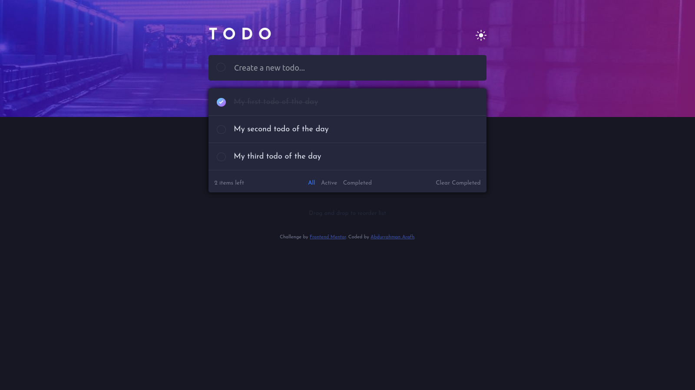

# Frontend Mentor - Todo app solution

This is a solution to the [Todo app challenge on Frontend Mentor](https://www.frontendmentor.io/challenges/todo-app-Su1_KokOW). Frontend Mentor challenges help you improve your coding skills by building realistic projects. 

## Table of contents

- [Frontend Mentor - Todo app solution](#frontend-mentor---todo-app-solution)
  - [Table of contents](#table-of-contents)
  - [Overview](#overview)
    - [The challenge](#the-challenge)
    - [Screenshot](#screenshot)
    - [Links](#links)
  - [My process](#my-process)
    - [Built with](#built-with)
    - [What I learned](#what-i-learned)
    - [Useful resources](#useful-resources)
  - [Author](#author)
  - [Acknowledgments](#acknowledgments)

## Overview

### The challenge

Users should be able to:

- View the optimal layout for the app depending on their device's screen size
- See hover states for all interactive elements on the page
- Add new todos to the list
- Mark todos as complete
- Delete todos from the list
- Filter by all/active/complete todos
- Clear all completed todos
- Toggle light and dark mode
- Have their state saved
- Have all their notes saved
- Drag and drop to reorder items on the list

### Screenshot

### Links

- Solution URL: [here](https://github.com/AbdoArafh/todo-app)
- Live Site URL: [here](https://abdoarafh.github.io/todo-app/)

### Built with

- Semantic HTML5 markup
- SCSS
- Flexbox
- Vanilla JavaScript
- CSS Grid
- Desktop-first workflow
- [Vite](https://vitejs.dev/)

### What I learned

I learned to use Vanilla JavaScript in a better way and utilize it
to make better solutions without any frameworks.

Even though using vanilla JavaScript was a bit stressfull and frustrating
at times. The joy of reinventing the wheel is sometimes worth it.

### Useful resources

- [An Article](https://webdevtrick.com/html-drag-and-drop-list/) this article
was pretty usefull for me to make draggable notes

## Author

- Frontend Mentor - [@AbdoArafh](https://www.frontendmentor.io/profile/AbdoArafh)
- Twitter - [@abdoarafh](https://www.twitter.com/abdoarafh)

## Acknowledgments

Thank you [Frontend Mentor](https://www.frontendmentor.io/) as always for the great designs and ideas